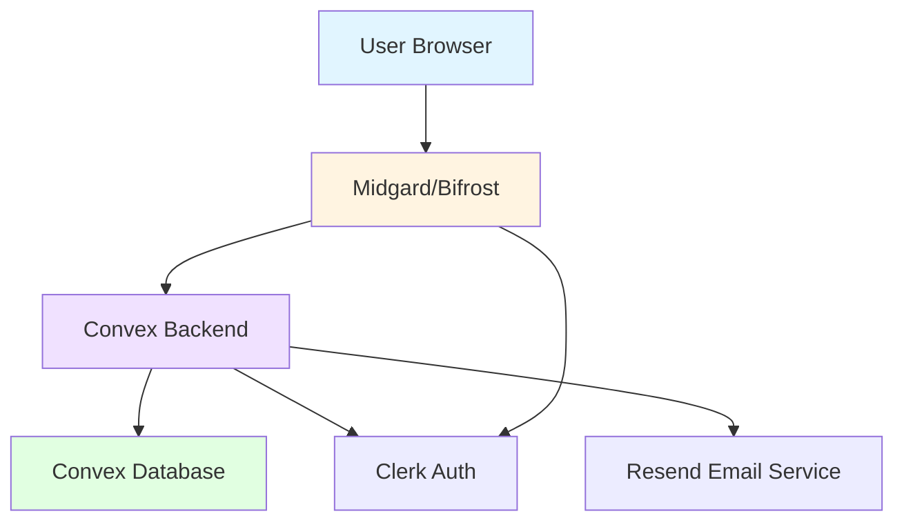

## Overview

Yggdrasil is a [Turborepo](https://turbo.build/repo)-based monorepo that manages multiple Next.js applications and shared packages. The architecture emphasizes code reuse, type safety, and developer experience through shared configurations and packages.

## Monorepo Structure

The repository is organized into apps and packages:

```
🌳 yggdrasil/
├── 📁 apps/
│   ├── 🌈 bifrost/      # Admin dashboard
│   └── 🌍 midgard/      # Main website (ifinavet.no)
├── 📦 packages/
│   ├── 🔐 auth/            # Authentication utilities
│   ├── 🗄️ backend/         # Convex backend logic
│   ├── 📧 emails/          # React Email components
│   ├── 🔧 shared/          # Shared utilities and types
│   ├── 📝 typescript-config/ # Shared TypeScript configs
│   └── 🎨 ui/              # Shared React component library
├── 📁 documentation/      # Documentation files
├── 📜 package.json        # Monorepo scripts and dependencies
├── 📜 turbo.json          # Turborepo configuration
└── 📜 biome.json          # Biome linting/formatting config
```

## Applications

### Bifrost - Admin Dashboard

**Purpose**: Central hub for administrative operations and content management.

**Key Features**:
- Event creation and management
- Student member administration
- Job listing management
- Company database
- Resource and article publishing

**Tech Stack**:
- Next.js with App Router
- TypeScript for type safety
- shadcn/ui components (minimally styled)
- Tiptap rich text editor
- Convex for backend
- Clerk for authentication

**Structure**:
```
apps/bifrost/src/
├── app/
│   ├── (admin-pages)   # Admin-specific layouts
│   ├── events/         # Event management
│   ├── job-listings/   # Job posting management
│   ├── profile/        # User profiles
│   └── resources/      # Resource management
├── components/         # React components
├── constants/          # Schemas and constants
├── hooks/              # Custom React hooks
├── lib/                # Core logic and Zustand stores
└── utils/              # Utility functions
```

**Port**: `3000` (development)

### Midgard - Main Website

**Purpose**: Public-facing website at [ifinavet.no](https://ifinavet.no) for students and companies.

**Key Features**:
- Event calendar and registration
- Job listing discovery
- Company profiles
- Student resources
- Organization information

**Tech Stack**:
- Next.js with App Router
- TypeScript
- shadcn/ui components (heavily customized)
- Tiptap rich text editor
- Convex for real-time data
- Clerk for authentication

**Structure**:
```
apps/midgard/src/
├── app/
│   ├── (auth)/         # Authentication pages
│   ├── (home)/         # Landing page
│   ├── companies/      # Company information
│   ├── students/       # Student information
│   ├── contact/        # Contact page
│   ├── job-listings/   # Job discovery
│   ├── profile/        # User profiles
│   ├── events/         # Event pages
│   ├── info/           # Event details
│   └── organization/   # About IFI-Navet
├── components/         # React components
├── constants/          # Constants
├── provider/           # App providers
└── utils/              # Utilities
```

**Port**: `3001` (development)

## Shared Packages

The monorepo uses shared packages to promote code reuse and maintain consistency:

### `@workspace/auth`

Authentication utilities and helpers for Clerk integration.

### `@workspace/backend`

**Convex Backend Logic**

Contains all Convex functions, schemas, and database logic:
- Database queries and mutations
- Real-time subscriptions
- Server-side business logic
- Data validation schemas

<Info>
  Convex provides a real-time sync engine that automatically updates all connected clients when data changes. This eliminates the need for manual cache invalidation and polling.
</Info>

### `@workspace/emails`

**React Email Components**

Email templates built with [React Email](https://react.email/):
- Event registration confirmations
- Notification emails
- Transactional emails

Emails are sent using [Resend](https://resend.com/).

### `@workspace/shared`

Shared utilities, types, and helper functions used across applications.

### `@workspace/typescript-config`

Shared TypeScript configurations for consistent type checking across the monorepo:
- `base.json` - Base TypeScript config
- `nextjs.json` - Next.js-specific config
- `react-library.json` - React library config

### `@workspace/ui`

**Shared Component Library**

Reusable React components built with:
- [Radix UI](https://www.radix-ui.com/) primitives
- Tailwind CSS for styling
- shadcn/ui patterns

Components include buttons, forms, dialogs, and more.

## Turborepo Configuration

The `turbo.json` file defines task pipelines and caching strategies:

```json
{
  "tasks": {
    "build": {
      "dependsOn": ["^build"],
      "outputs": [".next/**", "!.next/cache/**"]
    },
    "dev": {
      "cache": false,
      "persistent": true
    },
    "lint": {
      "dependsOn": ["^lint"]
    }
  }
}
```

**Key Features**:
- **Dependency-aware builds**: Packages are built before dependent apps
- **Caching**: Build outputs are cached for faster subsequent builds
- **Parallel execution**: Tasks run in parallel when possible
- **Environment variable management**: Required env vars are declared per task

## Data Flow Architecture



### Authentication Flow

1. User authenticates via Clerk in Bifrost or Midgard
2. Clerk issues a JWT token
3. Next.js middleware validates the token
4. Convex receives authenticated requests with user context
5. Backend enforces authorization rules

### Real-time Data Sync

1. Client subscribes to Convex queries using `useQuery`
2. Convex establishes WebSocket connection
3. When data changes, Convex pushes updates to all subscribed clients
4. React components automatically re-render with new data

<Note>
  This architecture eliminates the need for manual polling or cache invalidation. All clients stay in sync automatically.
</Note>

## Technology Decisions

### Why Turborepo?

- **Fast builds**: Intelligent caching and parallelization
- **Simple configuration**: Minimal setup compared to alternatives
- **Great DX**: Clear task outputs and error messages
- **Monorepo-native**: Built specifically for JavaScript monorepos

### Why Convex?

- **Real-time by default**: WebSocket-based sync engine
- **Type-safe**: Generated TypeScript types from schema
- **Serverless**: No infrastructure to manage
- **Great DX**: Local development server with hot reload

### Why Next.js?

- **Full-stack framework**: API routes, server components, and client rendering
- **Performance**: Automatic code splitting and optimization
- **Developer experience**: Fast refresh, TypeScript support
- **Production-ready**: Built-in optimizations and best practices

### Why Clerk?

- **Complete auth solution**: Sign-up, sign-in, user management
- **Secure**: Industry-standard security practices
- **Easy integration**: Drop-in components for Next.js
- **Customizable**: Flexible theming and branding

<Info>
  The team is currently assessing alternatives to Clerk for future releases to reduce external dependencies.
</Info>

## Build Pipeline

### Development

```bash
pnpm dev
```

1. Turborepo starts all `dev` tasks in parallel
2. Each app starts its Next.js dev server
3. Hot module replacement (HMR) enabled
4. Convex runs local development backend

### Production Build

```bash
pnpm build
```

1. TypeScript configs are resolved from `@workspace/typescript-config`
2. Shared packages (`ui`, `backend`, etc.) are built first
3. Applications (`bifrost`, `midgard`) are built with dependencies
4. Turborepo caches outputs for incremental builds
5. Next.js optimizes bundles for production

### Deployment

Each application is deployed independently:

- **Frontend apps**: Deployed to Vercel or similar platforms
- **Convex backend**: Deployed to Convex cloud
- **Environment variables**: Configured per deployment environment

## Code Quality Tools

### Biome

[Biome](https://biomejs.dev/) handles linting and formatting:

```bash
pnpm check:all        # Check all files
pnpm check:all:fix    # Fix issues automatically
```

### TypeScript

Strict TypeScript configuration enforces:
- No implicit `any`
- Strict null checks
- No unused variables
- Consistent imports

### Zod Validation

[Zod](https://zod.dev/) provides runtime validation:
- Form validation in UI
- API request/response validation
- Convex function argument validation

## Performance Considerations

### Build Performance

- **Turborepo caching**: Reuses build artifacts when possible
- **Parallel builds**: Independent packages build simultaneously
- **Incremental builds**: Only changed packages are rebuilt

### Runtime Performance

- **Code splitting**: Next.js automatically splits routes
- **Image optimization**: Built-in Next.js image optimization
- **Real-time updates**: Convex pushes only changed data
- **React 19**: Latest React features and optimizations

### Database Performance

- **Convex indexes**: Optimized queries with proper indexing
- **Query subscriptions**: Efficient WebSocket connections
- **Caching**: Automatic caching of query results

## Security Architecture

### Authentication

- Clerk handles user authentication
- JWT tokens for session management
- Secure cookie storage

### Authorization

- Role-based access control (RBAC)
- Convex functions validate user permissions
- Server-side authorization checks

### Data Protection

- HTTPS in production
- Environment variables for secrets
- No sensitive data in client bundles

## Extensibility

The monorepo is designed for easy extension:

### Adding a New App

1. Create new directory in `apps/`
2. Add to `pnpm-workspace.yaml`
3. Configure in `turbo.json`
4. Import shared packages as needed

### Adding a New Package

1. Create new directory in `packages/`
2. Add `package.json` with `@workspace/*` name
3. Export from `index.ts`
4. Import in apps using workspace protocol

### Adding a New Feature

1. Update Convex schema if needed
2. Create backend functions in `@workspace/backend`
3. Build UI components in `@workspace/ui` or app-specific components
4. Add pages/routes in relevant app

## Next Steps

<CardGroup cols={2}>
  <Card title="Bifrost Guide" icon="shield" href="/applications/bifrost/overview">
    Deep dive into the admin dashboard
  </Card>
  <Card title="Midgard Guide" icon="earth-americas" href="/applications/midgard/overview">
    Explore the main website architecture
  </Card>
  <Card title="Backend Reference" icon="database" href="/backend/schema">
    Learn about Convex functions and schemas
  </Card>
  <Card title="UI Components" icon="palette" href="/packages/ui/overview">
    Browse the shared component library
  </Card>
</CardGroup>